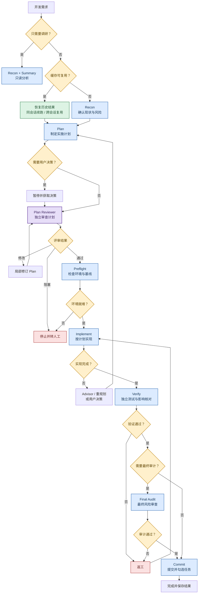
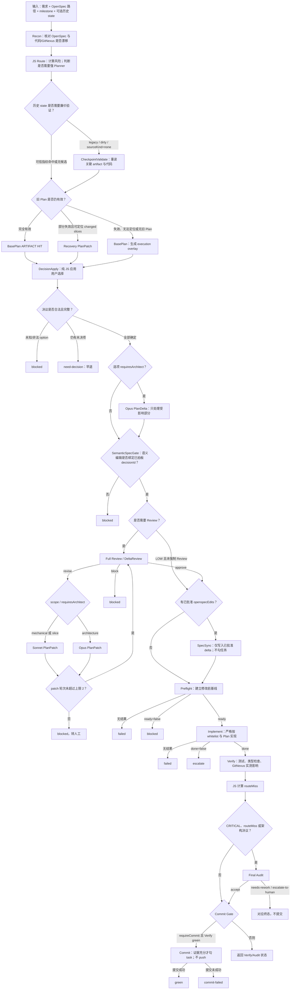
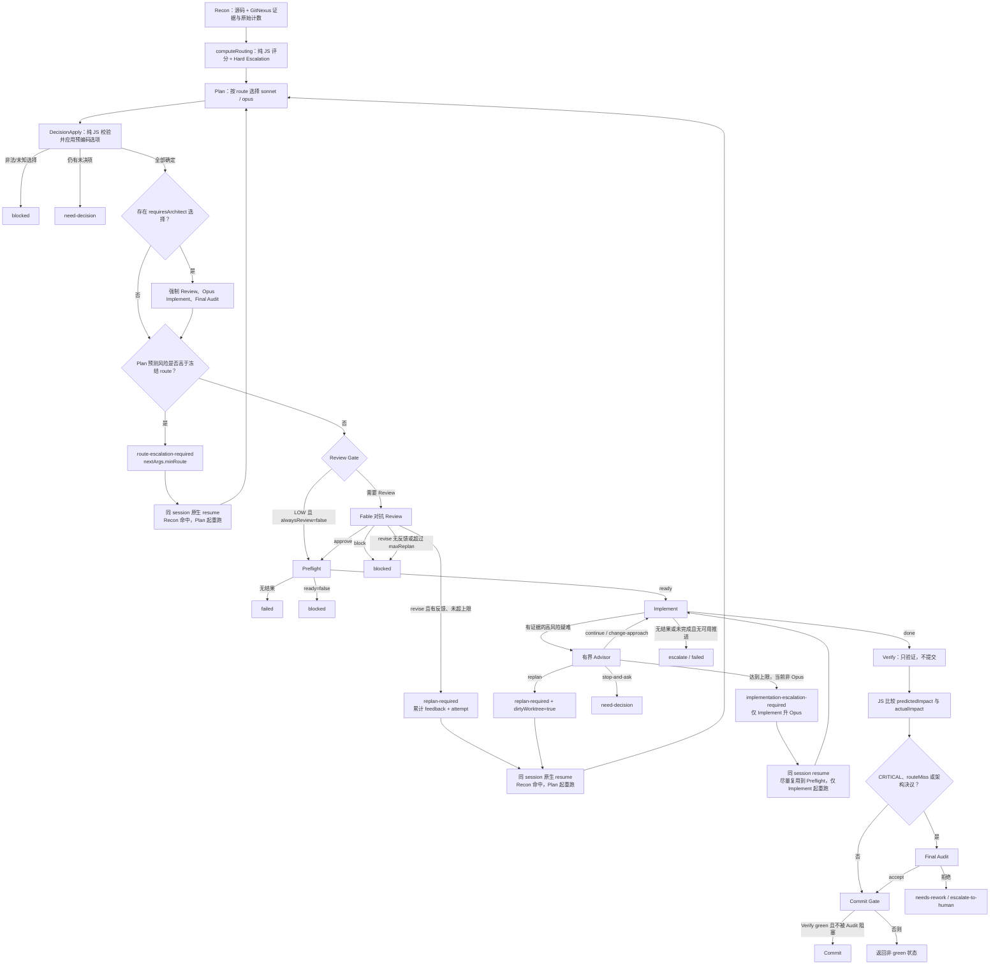
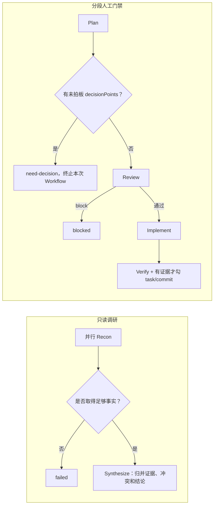
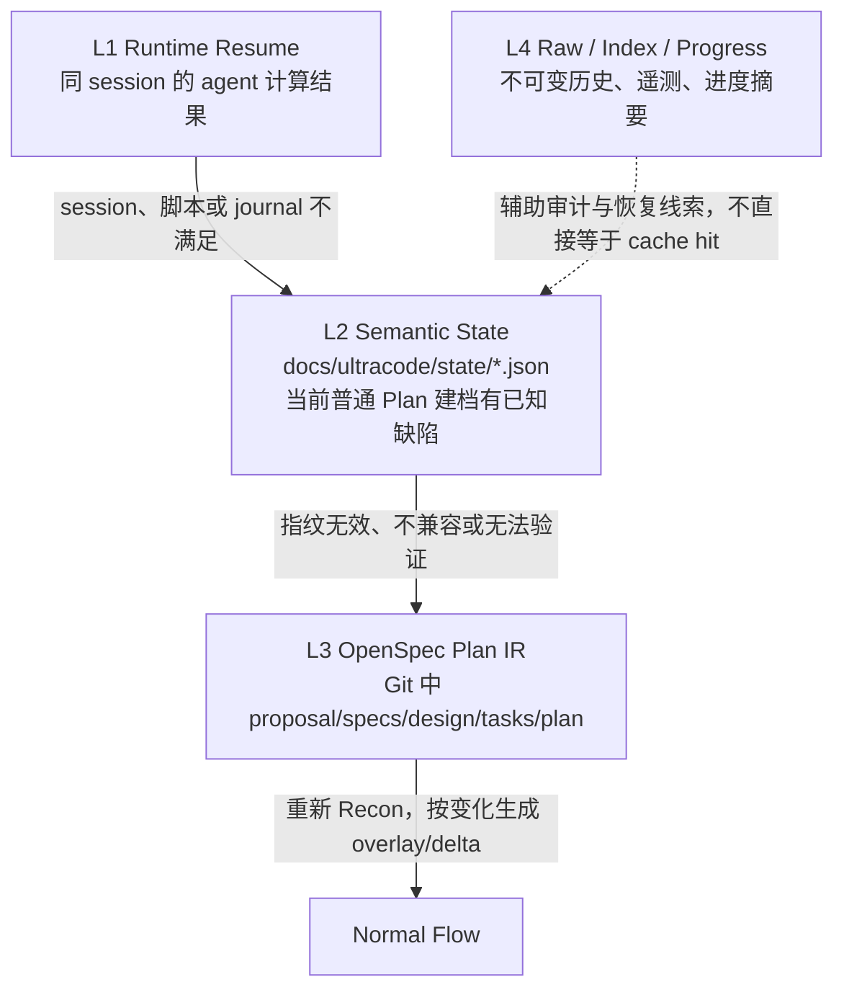
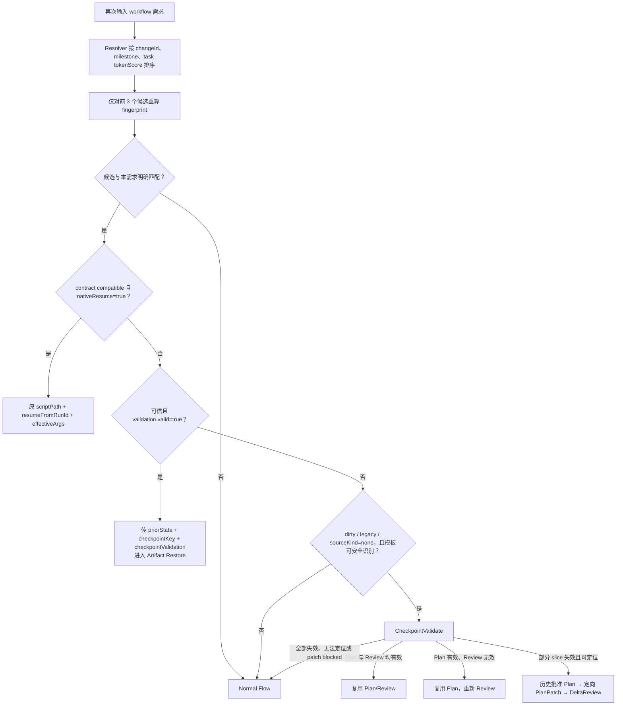
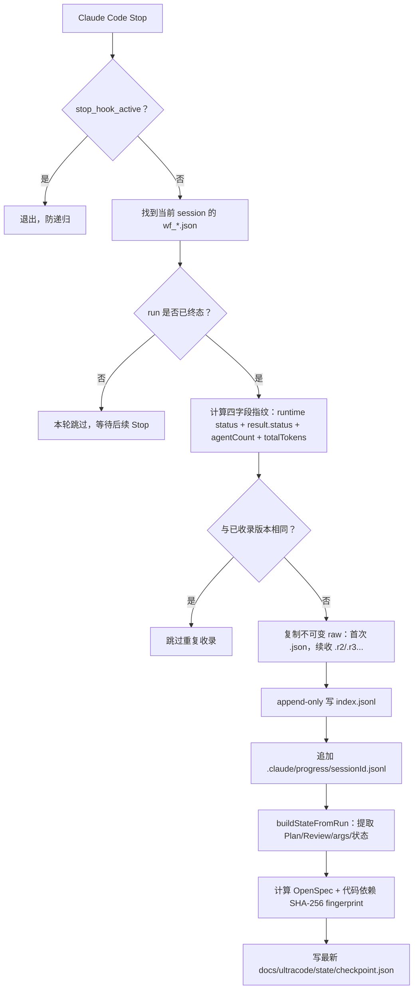

# Claude Code `workflow-experience` 插件：Workflow 阶段、判断与缓存复用

> 适用版本：`workflow-experience` v0.4.4（仓库提交 `067da2b89b4adc10b5a3475d168594c29f1f0a4d`）<br>
> 本文描述的是当前源码行为。图中的“缓存命中”均受兼容性、指纹和风险门禁约束，不代表仅凭旧聊天或旧结果即可复用。

## 1. PPT 精简版：主要流程

可手动调整的 draw.io 源图：[`workflow-main-flow.drawio`](workflow-main-flow.drawio)



### 1.1 主要阶段的作用

| 阶段 | 主要作用 |
|---|---|
| Recon | 确认代码现状、调用关系、依赖与风险，避免基于错误假设规划 |
| Plan | 把需求拆成可执行步骤、修改文件范围和验证方式 |
| Plan Reviewer | 独立挑战 Plan，检查遗漏、错误假设、影响范围、回滚与测试；不直接写代码 |
| Preflight | 检查环境是否可执行，并记录修改前基线，防止把已有失败归因于本次修改 |
| Implement | 严格按已批准 Plan 和文件白名单修改代码 |
| Verify | 不相信实现层自述，独立运行测试，并比较计划影响与实际影响 |
| Final Audit | 仅在高风险、架构决策或影响超预估时执行，决定是否允许提交 |
| Commit | 只有验证通过且审计未阻塞时才提交；有证据才勾选任务 |

### 1.2 条件分支与缓存复用

| 条件 | 流程选择 |
|---|---|
| 只做调研 | 走 `Recon → Summary`，不进入开发流程 |
| Plan 需要用户决策 | 暂停；用户回答后恢复，尽量复用之前的 Recon/Plan |
| Plan Reviewer 要求修改 | 只修受影响部分，再交回 Reviewer 复审 |
| Preflight 不就绪 | 停止，不进入 Implement |
| Implement 遇到高风险问题 | 进入 Advisor、重规划或用户决策分支 |
| Verify 未通过 | 返回 Implement 返工，不提交 |
| 高风险、架构决策或实际影响超预估 | 增加 Final Audit |

缓存只需记住三点：

1. **同会话恢复**：脚本没有变化时，直接续跑，未变化的前置阶段命中原生缓存。
2. **跨会话恢复**：代码与依赖指纹仍有效时，可复用历史 Recon、Plan 和已批准 Review；失效则重新验证或重跑。

`four-phase.js` 是稳定参考模板。尽管文件沿用“四阶段”名称，当前实际阶段为 `Plan → Review → Preflight → Implement → Verify`；它不是上述意图路由的首选分支。

## 2. OpenSpec-first 主流程



### OpenSpec-first 各阶段判断

| 阶段 | 主要输入 | 判断逻辑 | 输出或早退 |
|---|---|---|---|
| Recon | OpenSpec artifact、源码、GitNexus | 输出 `coverage/drift/architectureGap/semanticSpecChange`；事实不清只会升级风险 | evidence map + route 原始事实 |
| Route | Recon 原始指标 | `architectureGap`、语义规格变化，或 OpenSpec 不完整且风险至少 HIGH 时，BasePlan 使用强模型 | 冻结本轮初始 route / planner model |
| CheckpointValidate | legacy、dirty、`sourceKind=none` 的旧 state | 亲自重读当前 artifact、slice、caller、contract；不能核实即 false | `planStillValid/reviewStillValid/changedSliceIds/requiresArchitect` |
| BasePlan | OpenSpec Plan IR + Recon | 只产 task→slice、文件、测试、依赖和最小 delta；不复述完整设计 | `basePlan` 或 `blocked/failed` |
| DecisionApply | `basePlan.decisionPoints` + `args.decisions` | 纯 JS 校验 decision id、option、slice id；普通选择 0 token | `effectivePlan`、`need-decision` 或 `blocked` |
| PlanDelta | 架构级已拍板选择 | 仅 `requiresArchitect=true` 才运行；不得重写未受影响 slice | 架构增量后的 EffectivePlan |
| SemanticSpecGate | `openspecEdits` | `semantic=true` 必须存在且命中已拍板 `decisionId` | 不满足即 `blocked` |
| Review | EffectivePlan + route + decisions | 首轮全审；PlanPatch 后只审 changed slices 与全局 invariant | `approve/revise/block` |
| PlanPatch | Reviewer 反馈 | mechanical/slice 用 `sonnet`；architecture 用 `opus`；最多 2 轮 | 局部合并后的 Plan 或 `blocked` |
| SpecSync | 已批准 `openspecEdits` | 只同步批准内容；不重新设计；禁止把 `[ ]` 改成 `[x]` | 更新 OpenSpec，并清空待应用 edits |
| Preflight | test commands | 无返回即 `failed`；`ready=false` 即 `blocked` | 修改前测试/typecheck 基线 |
| Implement | 批准后的 Plan | 只改 whitelist；不得碰 mustNotTouch；不得提交和提前勾 task | 完成或 `escalate/failed` |
| Verify | 实际代码和基线 | 独立重跑测试/typecheck，实测影响；任务仅登记为 `completedTaskIds` | green/red + actual impact |
| Audit | route 与 `routeMiss` | CRITICAL、影响显著超估或存在架构决议时必跑 | `accept/needs-rework/escalate-to-human` |
| Commit | Verify/Audit 结果 | 仅 `requireCommit && Verify=green && Audit 不阻塞`；只勾有证据任务 | commits 或 `commit-failed` |

## 3. 无 OpenSpec：GitNexus 动态路由链



### 路由评分与模型选择

总分由 JS 确定性计算，禁止让 Recon 模型主观报分：

| 维度 | 分值 | 摘要 |
|---|---:|---|
| Blast Radius | 0–30 | `depth1*4 + depth2*2 + depth3`，封顶 30 |
| Execution Flow | 0–15 | `executionFlows*3`，封顶 15 |
| Module/Repo Reach | 0–15 | crossRepo 15、crossModule 10、多文件 5、否则 1 |
| API/Contract | 0–15 | public API、schema、consumer、shape mismatch 累加 |
| Behavioral Risk | 0–10 | 并发、状态机、安全、持久化、迁移、反射/生成代码 |
| Uncertainty | 0–15 | 索引陈旧、partial、truncated、ambiguous、GitNexus 不可用等只升不降 |

默认阈值与模型链：

| Route | 分数 | Plan | Review | Implement | Final Audit |
|---|---:|---|---|---|---|
| LOW | 0–24 | sonnet | 默认跳过，可由 `alwaysReview` 强制 | sonnet | 发生 routeMiss 时运行 |
| MEDIUM | 25–49 | sonnet | fable | sonnet | 发生 routeMiss 时运行 |
| HIGH | 50–74 | opus | fable | sonnet | 发生 routeMiss 时运行 |
| CRITICAL | 75–100 | opus | fable | opus | 必跑 |

Hard Escalation 会覆盖低分结果：GitNexus 不可用、公共 API、shape mismatch、状态机/并发/持久化至少升 MEDIUM；cross-repo、安全、迁移至少升 HIGH；`partial/truncated + public API` 升 CRITICAL。Recon 返回空时 fail-safe 到 HIGH，并保留 `score=null`，不伪造分数。

`routeMiss` 的判断为三个维度任一满足：实际值大于预测值 1.5 倍，且绝对差大于 3。它必须在提交前计算，命中后先做 Final Audit。

## 4. 两个轻量分支



分段门禁强调的是“决议边界”，不是把所有里程碑塞入一个长 Workflow。用户同会话立即拍板可 resume；跨会话则依靠 OpenSpec、semantic state 和 raw 证据恢复。

## 5. 缓存与状态的四层模型

> [!WARNING]
> 当前 checkout 的 L2 Semantic State 建档存在已复现缺陷：`hooks/checkpoint-lib.cjs` 的 `resolveDependency()` 使用 `roots.map(path.resolve)`，数组下标会作为额外参数传给 `path.resolve`。普通 Plan 含代码依赖时会被外层捕获为 `skipped: "build-exception"`。因此本章描述的是当前设计逻辑，但新 run 的常规 state 在修复前无法可靠建立或刷新。L1 Runtime Resume、L3 OpenSpec Plan IR 以及 raw/index/progress 固化不受该问题影响。自带的 `node tools/verify-state-pipeline.mjs` 当前也未通过，且部分断言仍使用旧 `cacheVersion=1` 契约。



| 层级 | 保存内容 | 命中条件 | 主要价值 |
|---|---|---|---|
| Runtime Resume | 每个 agent 的原生计算缓存 | 同 session、原 `scriptPath`、脚本 SHA-1 相同、原 `runId` 的 `journal.jsonl` 存在 | 未变化的前缀直接 `CACHE HIT` |
| Semantic State | `recon/basePlan/effectivePlan/review/decisions/routing/resumeArgs` 与 fingerprint | checkpoint/contract 兼容，且依赖未变；特殊候选需 CheckpointValidate | 跨 run、跨 session、插件重装后跳过昂贵 Plan/Review |
| OpenSpec Plan IR | 产品/架构规划与任务状态 | Git 中 artifact 为当前 source of truth，Recon 证明没有不可接受 drift | 长期、可版本控制的规划缓存 |
| Raw / Index / Progress | 完整 run 快照、索引、进度摘要 | 不作为直接命中依据 | 审计、遥测、legacy backfill、人工恢复 |

“聊天仍在”不是缓存命中条件；`.claude/progress/*.jsonl` 默认只写不自动读，也不会自动注入其他会话的进度。

当前实测边界：下面 6.2–6.3 描述的是 state 成功建档后的判定逻辑；在上述 `resolveDependency()` 缺陷修复前，含常规代码文件依赖的 run 会在建档阶段提前返回 `build-exception`，因而不会进入这些 L2 命中分支。

## 6. 恢复决策树



### 6.1 Native Resume

必须同时满足：

1. 当前 `sessionId` 与 state 中一致；
2. 原 `scriptPath`、`scriptSha1`、`runId` 均存在；
3. 当前脚本内容 SHA-1 与历史一致；
4. 对应 `journal.jsonl` 已核实存在。

恢复调用必须复用原脚本，不能重新 author 一份“逻辑相同”的脚本。`args` 是全量替换，不是自动合并：

```js
effectiveArgs = {
  ...state.resumeArgs,
  ...(state.pendingTransition ? state.continuationArgs : {}),
  ...newArgs,
}

effectiveArgs.decisions = {
  ...state.resumeArgs.decisions,
  ...state.continuationArgs.decisions,
  ...state.decisionApply.decisions,
  ...newArgs.decisions,
}
```

随后使用：

```js
Workflow({
  scriptPath: state.scriptPath,
  resumeFromRunId: state.runId,
  args: effectiveArgs,
})
```

### 6.2 Semantic Artifact Restore

可信直接命中的基础门禁：

```text
checkpointKey 相同
AND state.kind = ultracode-semantic-state
AND schemaVersion = 2
AND cacheVersion = 2
AND templateKind 相同
AND legacyUnverified = false
AND dirtyWorktree = false
AND fingerprint.complete = true
AND checkpointValidation.valid = true
```

Fingerprint 覆盖：

- source：目标 OpenSpec change 下全部 Markdown；
- source extra：显式传入的 `proposalDoc/designDoc/tasksDoc/planDoc`；
- source glob：显式 `specsGlob`；
- code：`whitelist + slices.files + mustNotTouch + evidenceDependencies`，其中后两者用于覆盖 caller、public contract 和关键测试等证据依赖。

进一步的阶段级复用条件：

| 可复用项 | 额外条件 |
|---|---|
| Recon | 必须是可信指纹直接命中；legacy/dirty/`sourceKind=none` 不直接复用 Recon |
| BasePlan | 旧 Plan 仍有效；当前 route 不得高于历史 route；通用链存在 replan 输入时不得命中旧 BasePlan |
| EffectivePlan | BasePlan 已命中、decisions 完全相同、旧 EffectivePlan 存在且历史 Review 可复用 |
| Review | 旧 verdict 为 `approve`、`reviewReusable=true`、决议/route 合法，并且规范化后的完整 Review 输入完全一致 |

`sourceKind=none` 永远不会成为 trusted hit；即使代码指纹没变，也必须先做 CheckpointValidate。空 Markdown 树同样 fail-closed，避免空集合 hash 被误判为有效。

### 6.3 Dirty 与 legacy 的复用边界

| 候选状态 | 处理 |
|---|---|
| dirty：实现已开始但 Verify 未绿、Audit 拒绝或 commit 失败 | 禁止直接 Plan/Review hit；先 CheckpointValidate |
| dirty 且部分 slice 失效可定位 | 从上次已批准 EffectivePlan 出发，局部 Recovery PlanPatch，再 DeltaReview |
| dirty 且全部失效/无法定位 | 全量重规划或 fail-closed 转人工 |
| legacy：旧 raw 没有生成时刻 fingerprint | 禁止用“今天的 hash”伪造历史基线；只能 native resume 或先 CheckpointValidate |
| 普通 `valid=false` | 把 `changedPaths` 当作失效证据，不能复用旧 Plan/Review |
| cache/schema/template 版本不兼容 | 直接失效；除模板明确支持的 legacy 验证路径外，不得强行恢复 |

## 7. 原生 agent 缓存键与“粘滞 miss”

```text
cacheKey = sha256(前序调用滚动链 || prompt || 归一化 opts)
```

| 变化项 | 是否进入原生 cache key | 后果 |
|---|---|---|
| `prompt` | 是 | 当前 agent miss，后续全部重跑 |
| `schema/model/effort/isolation/agentType/disallowedTools/bashCommandClamp` | 是 | 当前 agent miss，后续全部重跑 |
| `label/phase` | 否 | 只改显示信息时不影响命中 |
| `args` 本身 | 否 | 但 args 若被拼入 prompt 或改变 route/model，仍会间接造成 miss |

一旦某个 agent miss，它之后的 agent 即使自身未变也会因“前序调用滚动链”变化而 miss。因此：

- 用户普通 decisions 不进入 BasePlan prompt，由 JS DecisionApply 应用，尽量保住昂贵 BasePlan；
- `route-escalation-required` 通过 `minRoute` 改 Plan prompt/model，使 Recon 命中而 Plan 及之后重跑；
- `replan-required` 把累计 feedback 与递增 attempt 放入 Plan prompt，保证 Plan 真正重跑并避免重复死循环；
- `implementation-escalation-required` 只改变 Implement model/prompt，目标是尽量复用 Recon、Plan、Review、Preflight；
- 易变的 Advisor 放在调用链后部，并有调用次数上限。

## 8. Harvest：如何把一次运行变成下一次可恢复状态



关键语义：

- 原生 resume 会原地更新同一个 run 文件；四字段指纹变化时会重新 harvest，并把后续版本写成 `.rN.json`，不会覆盖首轮早退证据；
- `index.jsonl` 始终 append-only，同一 `runId` 可出现多行；
- `SpecSync` 已完成时，state 中可复用 Plan 会清空 `openspecEdits`，原编辑另存到 `appliedOpenSpecEdits`，防止下次重复应用；
- `resumeArgs` 会移除 `priorState/checkpointValidation`，防止 state 递归膨胀；
- Hook 异常静默退出，不阻断 Claude Code 会话；因此“没有 state”应解释为没有可用缓存，不代表 Workflow 逻辑成功或失败。

## 9. 状态与后续动作速查

| 状态 | 含义 | 下一步 |
|---|---|---|
| `need-decision` | 必须由用户选择 | 同 session：resume + 完整 args + decisions；跨 session：优先 semantic restore/OpenSpec checkpoint |
| `route-escalation-required` | Planner 发现风险高于 Recon route | 同 session 原生 resume，携带 `nextArgs.minRoute` |
| `replan-required` | Review 或 Implement Advisor 要求修订 Plan | 原样携带完整 `nextArgs`；dirty 情况必须保留 `dirtyWorktree=true` |
| `implementation-escalation-required` | 当前实现模型已不适合继续 | resume 并只把 Implement 升级到 Opus |
| `blocked` | 门禁不允许继续，或修订已达上限 | 转人工解决 blocker；不得带病进入实现 |
| `failed` | agent 无结构化结果或关键阶段失败 | 保留原始证据，修复输入/环境后重跑 |
| `escalate` | 实现未完成或无法安全继续 | 人工判断是否 replan、拍板或升级实现模型 |
| `red / needs-rework / escalate-to-human` | 验证或审计未通过 | 不提交；后续 state 视为 dirty |
| `commit-failed` | 已满足提交前置条件，但提交动作失败 | 不得报告 green；检查提交错误后恢复 |
| `green` | Verify green，且需要的 Audit/Commit 门均满足 | 可视为当前里程碑完成 |

## 10. 源码依据

| 主题 | 当前位置 |
|---|---|
| 入口、候选注入与恢复公式 | [`hooks/workflow-intake.cjs`](../hooks/workflow-intake.cjs) |
| state 构建、fingerprint、候选排序、native resume 核验 | [`hooks/checkpoint-lib.cjs`](../hooks/checkpoint-lib.cjs) |
| Stop 时 raw/index/progress/state 固化 | [`hooks/harvest-workflow.cjs`](../hooks/harvest-workflow.cjs) |
| OpenSpec-first 阶段与局部恢复 | [`templates/openspec-incremental.js`](../templates/openspec-incremental.js) |
| GitNexus 动态路由、Advisor、routeMiss、Commit Gate | [`templates/gitnexus-routed.js`](../templates/gitnexus-routed.js) |
| 只读调研链 | [`templates/readonly-recon.js`](../templates/readonly-recon.js) |
| 分段拍板链 | [`templates/stage-with-gates.js`](../templates/stage-with-gates.js) |
| 缓存实测说明 | [`skills/workflow-experience/references/resume-and-args.md`](../skills/workflow-experience/references/resume-and-args.md) |
| OpenSpec Plan IR 设计 | [`skills/workflow-experience/references/openspec-first.md`](../skills/workflow-experience/references/openspec-first.md) |
| 动态评分与模型路由 | [`skills/workflow-experience/references/dynamic-routing.md`](../skills/workflow-experience/references/dynamic-routing.md) |
| 持久语义缓存 ADR | [`docs/decisions/007-persistent-semantic-cache.md`](decisions/007-persistent-semantic-cache.md) |
